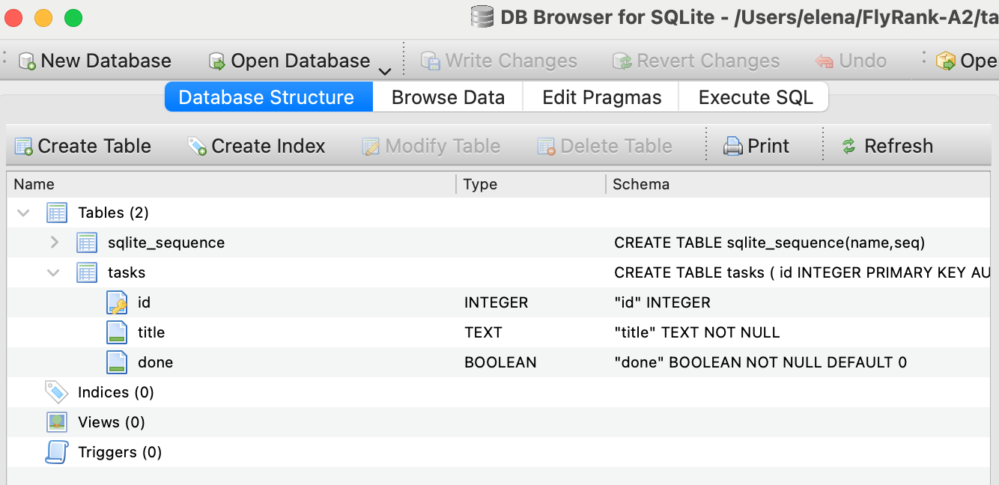
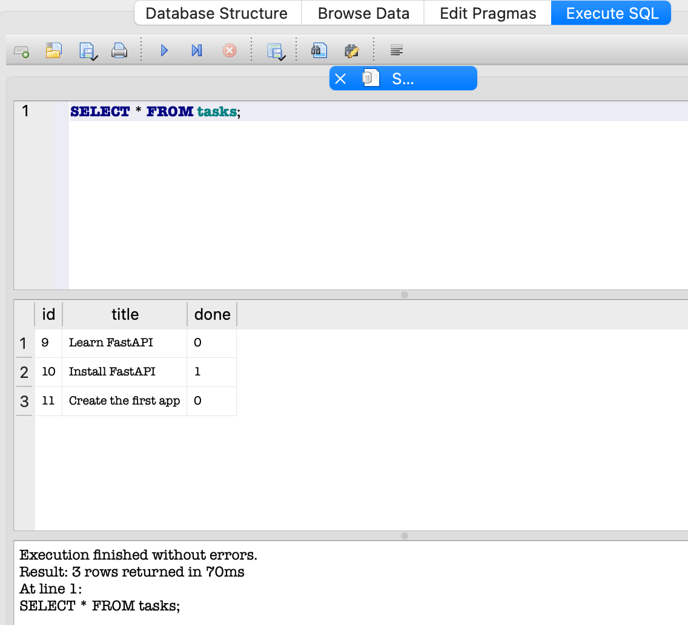

# CRUD application
Here is a small CRUD application build with FastAPI to demonstrate what can be done with this tool. It has a list of tasks in **SQLite** database. 

**SQLite** was chosen for this task because of the following benefits:
* The entire database is just one file. It is simple and portable.
* SQLite is serverless. You do not need install anything, configure and manage. SQLite available by using python module sqlite3.
* In the same time SQLite stores data in database file, not in memory, it helps to store data safely.

## The database location and installation:
- Database file is located in the main project folder.
- When starting application checks if the file exist and if it is not empty. 
- If it doesn't exist or empty, then application will create it and add three examples of tasks to database.

Here is a screenshot with database opened in DB Browser for SQLite (it is free utility for SQLite databases administration):


Initial data:


## How to install and launch application

1. Ensure that you have python installed.
2. Install the dependancy:
```bash
pip install fastapi uvicorn
```
3. Launch the app:
```bash
python main.py
```
4. After the application is launched, it is accessible via URL: `http://127.0.0.1:8000`
Its Swagger documentation is accessible via URL: `http://127.0.0.1:8000/docs`

## Available endpoints:
| Method | Endpoint | Description |
| :--- | :--- | :--- |
| **GET** | `/` | Returns application name, version, and endpoints. |
| **GET** | `/health` | Server health check (returns status: ok). |
| **GET** | `/tasks` | Retrieves all tasks from the database. |
| **GET** | `/tasks/{id}` | Retrieves a specific task by its ID. |
| **POST** | `/tasks` | Creates a new task (expects JSON body `{"title": "..."}`). |
| **PUT** | `/tasks/{id}` | Updates an existing task's title and/or done status. |
| **DELETE** | `/tasks/{id}` | Deletes a task from the database. |
